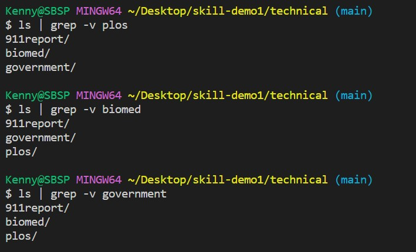
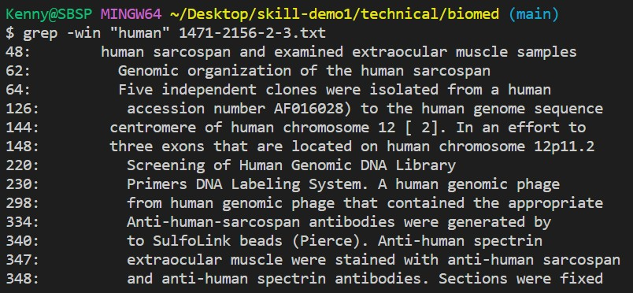
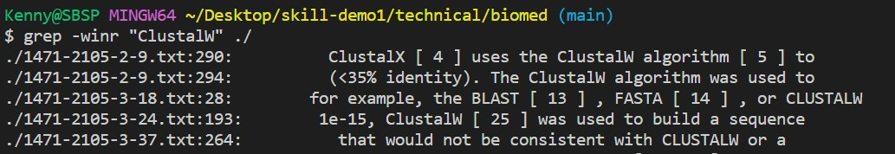
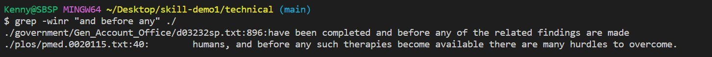
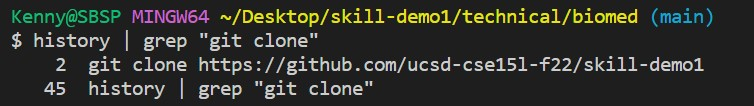
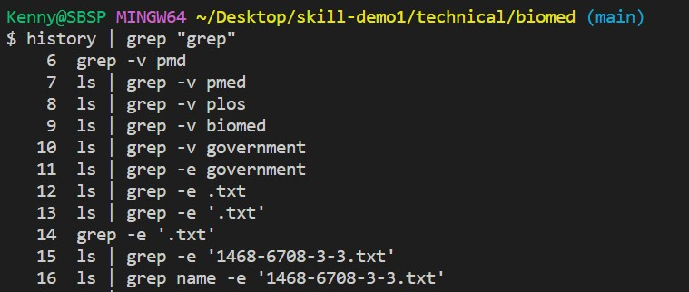
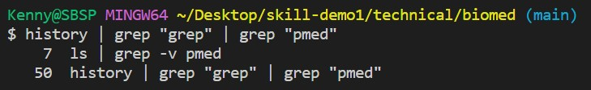

# Lab Report 3

The first interesting grep command is -v. Instead of finding the file of the matching name, -v sort of allow us to filter out the files of the matching names. Above are three examples.
___

Next interesting grep command is -win. The string immediately after "-win" is the string that we want to look for in the file, which goes immediately after the string. The "i" in "-win" means that we want the command to output all the results containing both uppercase letters and lowercase letters. The "n" in "-win" tells the command that we also want to see which line is the string found in the file.

___

More interestingly, we can change "win" to "winr", and it allows us to search the current directory that we are in instead of searching one file.

___

Now that if we go to the parent directory and type in "winr", we actually get the result from files from different subdirectories, just basically everything that matches the string.

___

Next intersting thing is that we can search our history using grep. For the above example, it returns the two lines of my commands that contains "git clone". This is pretty useful especially if you have hundreds of commandlines in your history and you need to find a specific one.

___

Here's just another example

___

Now, when we use history, we can do another search within the previous search results to even get a more precise output. In the example above, I'm basically telling the command line to ouput my historys that contains both "grep" and "pmed" 

